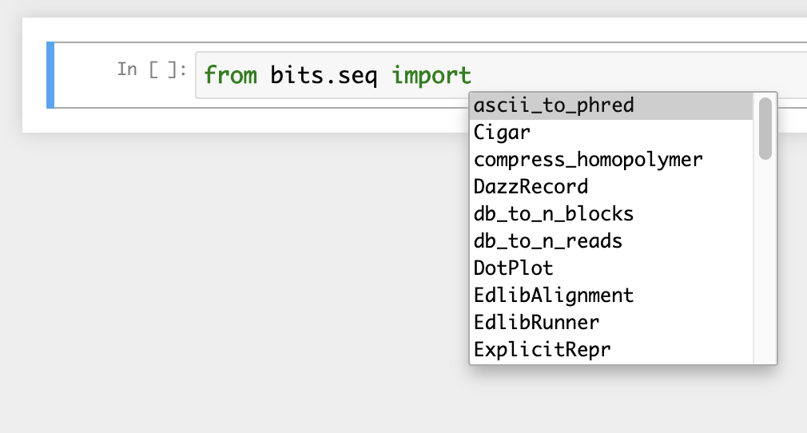

# BITS: miscellaneous BioInformatics ToolS

Basically bioinformatics-related, reusable Python codes as a package. Developed in Python 3.7, but most of the codes should work with any Python >= 3.

## Requirements

- Python packages listed in `setup.cfg` (automatically installed)
- [Seqkit](https://bioinf.shenwei.me/seqkit/) (if you use `bits.seq.load_fast[a|q]` with `range=` option)
- [Edlib](https://github.com/Martinsos/edlib) (if you use `bits.seq.EdlibRunner`)
- [Gepard](https://github.com/univieCUBE/gepard) (if you use `bits.seq.DotPlot`)
- [DAZZ_DB](https://github.com/thegenemyers/DAZZ_DB) (if you use `bits.seq.load_db` etc)

## How to install

```bash
$ git clone https://github.com/yoshihikosuzuki/bits
$ cd bits
$ python3 setup.py install
```

## How to use

BITS has two submodules:

- `bits.seq` for DNA sequence manipulations, and
- `bits.util` for other, general purposes in Python programming.

Import and use any function/class as follows:

```python
from bits.seq import revcomp_seq
print(revcomp_seq('aactg'))
```

```text
> cagtt
```

## List of functions

If you are using IPython or Jupyter, you can look at the list of functions and classes with the completion function they provide, by typing `from bits.seq import ` + `TAB`:



and `from bits.util import ` + `TAB`:


